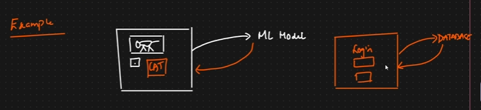

Flask framework : 

1. WSGI - > web server gateway interface
2. JINJA 2 TEMPLATE ENGINE

flask : It is a complete web framework which is created completely using python programming language.

web server : example(aws,azure,gcs,apache)
in this web server we deploy our web app which is completely made of flask framework.

now suppose we made requests to web server we must redirect the requets to web app.
to communicate to these web app we need certain PROTOCOL .

the protocol we gonna use is WSGI.
the flask framework uses these.

2.JINJA 2 template engine : 
web template engine -> it combines a web template(pages in a website) with a data source.
data source -> ex(sql db,csv sheet,ml model,mongoDB)

web page will get loaded

 ---> 

we are creating dynamic web pages

A dynamic webpage is a webpage whose content can change automatically based on user actions, data, or time — instead of always showing the same fixed content.
